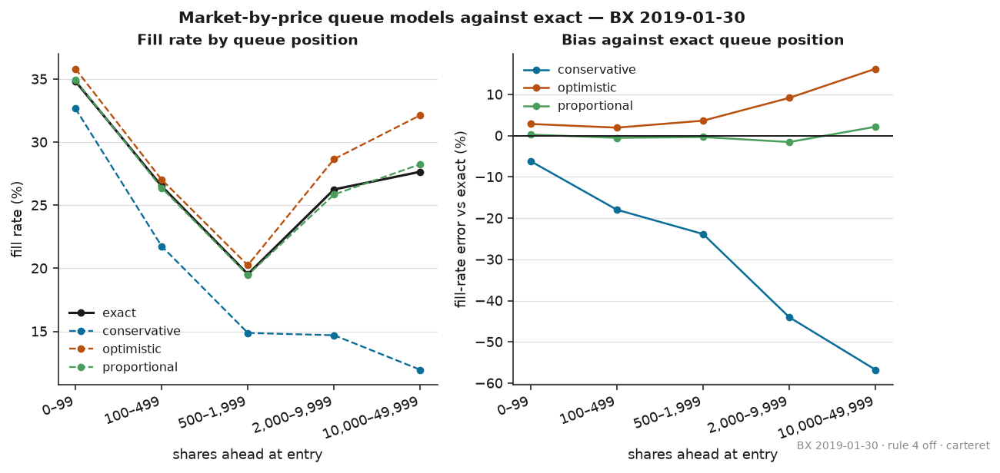
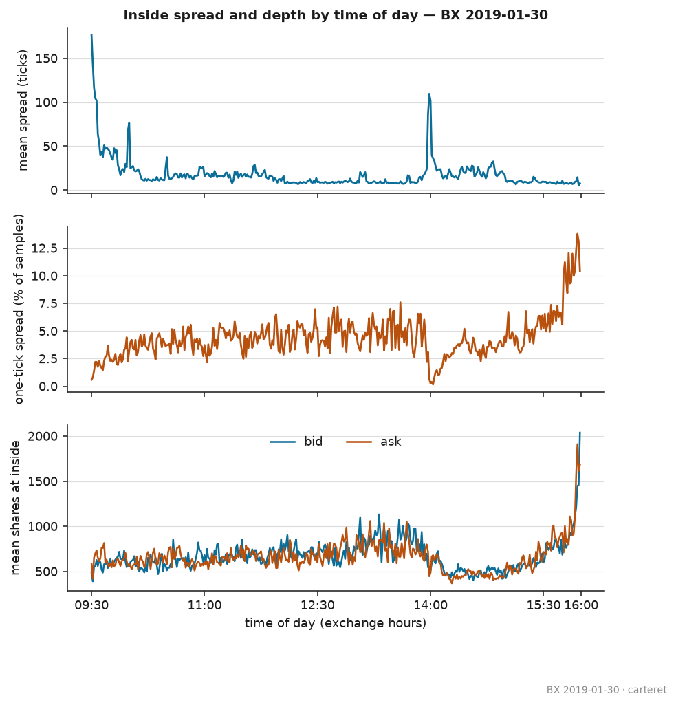
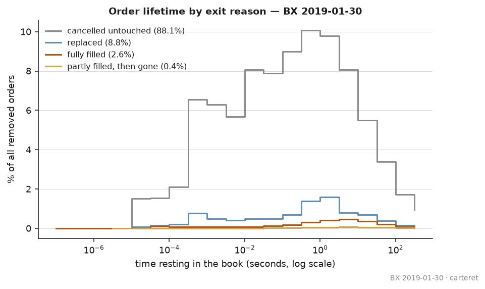
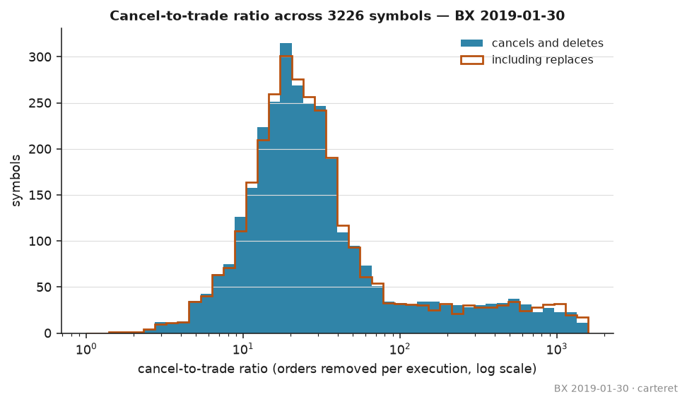
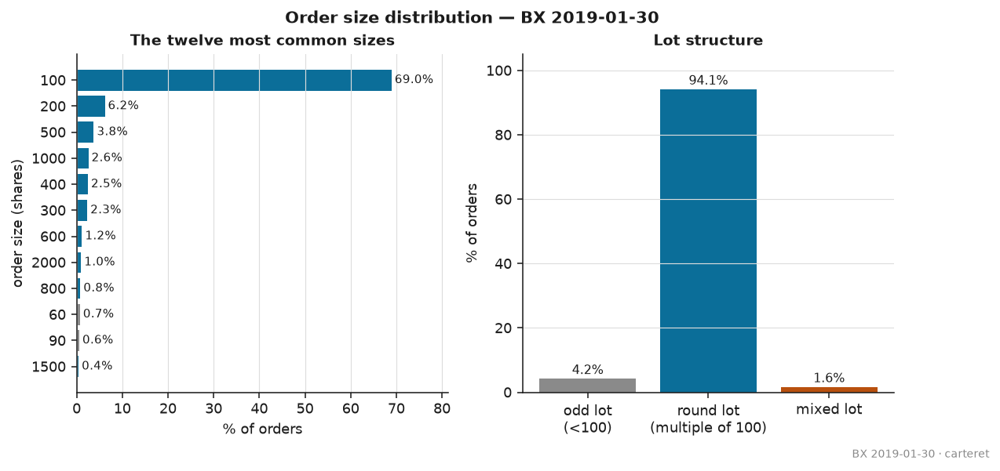

# Carteret

[](https://github.com/EkanshSingh401/carteret/actions/workflows/ci.yml)

A NASDAQ TotalView-ITCH 5.0 feed handler and market-by-order limit order book
in C++20, with a benchmark harness, a five-layer correctness argument, a
queue-position bias study, and a pre-registered predictive study.

Named for the New Jersey data centre the ITCH 5.0 specification names as the
origin of the TotalView feed.

## Results

| | |
|---|---|
| Messages parsed | 82,841,542 (`20190130.BX_ITCH_50`, 2.42 GB) |
| Parser verified against | `RITCH::count_messages()`, exact on all 22 types it reports |
| Fuzzing | 408M executions under ASan and UBSan, no findings |
| Book update p50 / p99.9 | — |
| Throughput | — |
| Machine | — |

*Latency and throughput stay empty until they are measured on the x86_64 Linux
benchmark host. Nothing timed on the development host or in CI is published;
see `docs/benchmarks.md`.*

**Status: in progress.** Implemented and passing: the wire layer and framing,
the specification tables with a compile-time field-layout audit, typed views
for all 23 message types, the handler-templated parser, the fuzz target, the
message census, the reference book, the fast book, the differential harness,
the determinism hashes, the MoldUDP64 feed layer, the microstructure export
and analysis, and the queue-position simulator and bias study.

Outstanding: the benchmark harness has been built and smoke-tested but has
produced **no published number**, because that requires the x86_64 Linux host.
The Stage 8 study is drafted and gated but **unregistered**: the author
chooses the primary hypothesis, completes the power analysis on development
sessions, commits `docs/preregistration.md`, and writes that commit's hash
into `research/heldout.lock`. The held-out sessions have not been
downloaded.

## Limitations

Stated before the results, because they are what makes the results meaningful.

- **No wire path.** No NIC, no kernel network stack, no kernel bypass. The
  benchmark measures book-update cost, not wire-to-book latency.
- **Throughput, not responsiveness.** Replay from a file has no arrival
  process and no queueing, so the numbers say nothing about behaviour under
  load.
- **Single-threaded.** Sharding by stock locate is the obvious parallelisation
  and is out of scope.
- **Hidden liquidity is invisible.** `P` messages report non-displayed
  executions after the fact; those orders never enter the book, so fills
  against hidden liquidity are unmodelled.
- **Replay cannot react.** Any simulated order assumes zero market impact,
  which is defensible only for small orders.
- **The price axis is in cents**, correct for the 2017-2020 sessions used here
  and not for post-amendment tick sizes. See `docs/design.md` record 005.
- **Out of scope:** matching engine, strategy and order-entry layer, web
  interface, containerisation.

## Prior art

Reconstructing exact FIFO queue position from market-by-order data is **not
novel**. HftBacktest ships an `L3FIFOQueueModel`, and its Level-3 tutorial
builds L2 data from L3 to compare the two backtests on crypto futures. This
project implements a known model.

The contribution claimed here is narrower: **the quantified fill-rate and
time-to-fill bias of each market-by-price approximation against exact queue
position, on US-equity ITCH sessions, with the fill rules stated explicitly**,
broken out by queue depth at entry and by symbol. See `docs/design.md` records
020 and 021.

The pre-registered study is **predictive** (interval *t* predicts interval
*t+1*). Cont, Kukanov and Stoikov (2014) report a **contemporaneous** R² of
approximately 65% over 10-second windows. The two are not comparable and are
never presented as though they were; see `docs/design.md` record 023.

## Correctness

Five layers, each proving something different and each naming what it does not
prove. `docs/correctness.md` carries the detail and the per-session results.

| Layer | Proves | Does not prove |
|---|---|---|
| 1. Byte fixtures, tiling audit, fuzz | Field offsets and framing | Anything about the book |
| 2. Census against an independent counter | The framing loop walks the file correctly | Field decode |
| 3. LOBSTER row-by-row replay | **Not available.** LOBSTER's samples are gated behind proof of purchase, and its sample date has no counterpart in the NASDAQ archive | — |
| 4. Differential replay against the reference book | The fast book matches the obvious one | That the obvious one is right |
| 5. Continuous invariants and determinism hashes | Internal consistency; that a rerun is the same run | Agreement with the venue |

The reference book — `std::map`, `std::unordered_map`, `std::list` — is
permanent, not a stepping stone. It is both the differential oracle and the
speedup baseline.

**Layer 3 is unavailable, and that leaves a real gap.** Nothing now constrains
the book's semantics against an independently built reconstruction. A shared
misunderstanding of the feed — if `U` did not in fact lose queue priority at
an unchanged price, say — would pass every remaining layer. `docs/correctness.md`
records what was checked and what would close it.

### Wire format

NASDAQ BinaryFILE precedes each message with a 2-byte big-endian length; a zero
length marks end of session. `FrameReader` treats the prefix as authoritative
for advancing and additionally checks it against the specification length for
known types in one table lookup. A frame whose length disagrees, or whose type
is unknown, is skipped by its prefix length and counted, never parsed, so that
one malformed frame cannot desynchronise the rest of the session
(`docs/design.md` record 001).

One file in circulation breaks that assumption: `ex20101224.TEST_ITCH_50`,
bundled with the RITCH R package, carries the prefix field for all 12,012 of
its messages and leaves every one zero. Since a zero prefix is the
end-of-session marker in the prefixed form, the two cannot be read under one
rule; the form is identified before the walk and reported by the census
(`docs/design.md` record 025).

Multi-byte fields are decoded with `memcpy` plus `__builtin_bswap`, never a
pointer cast: the 64-bit order reference at offset 11 is unaligned, and the
cast is both an unaligned load and a strict-aliasing violation. Timestamp and
tracking number come from a single 8-byte load at offset 3. Generated assembly
and the command that produced it are in `docs/design.md` record 002.

### Specification behaviour that reconstructions get wrong

All of the following are documented inline in `spec.hpp` at the relevant field.

1. `E`, `C` and `X` carry **cumulative deductions**, not absolute sizes. An
   order reaching zero displayed shares is removed even without a `D`.
2. `U` carries **no side, stock or attribution**; all three are retained from
   the original Add. It mints a new reference and loses queue priority
   unconditionally, including when the price is unchanged.
3. `E` has **no price field**; the resting order's price applies. `C` carries
   its own price and a Printable flag.
4. `P` has **no book effect**. Its order reference has been zero since December
   2010 and its side field hardcoded `'B'` since 14 July 2014, so trade sign
   cannot be read from it.
5. `B` and `Q` have no book effect either, and **`B` and `D` can arrive after
   the end-of-system-hours event**.
6. Order references are **day-unique but not sequential** — the guarantee that
   they increase was removed in February 2009 — so a flat array indexed by
   reference is unsafe.
7. Stock Locate codes are **session-scoped**. Cross-session tooling keys on the
   symbol.
8. `V` (MWCB Decline Level) uses **Price(8)**, not Price(4).
9. `K` (IPO Quoting Period Update) carries `ReleaseTime` in **seconds** since
   midnight, not nanoseconds, and its Stock Locate is documented as always 0.
10. `Q` (Cross Trade) may legitimately report **zero shares**.

## Queue-position bias

The claimed contribution. Exact FIFO queue position from market-by-order data
is **not novel** — HftBacktest ships an `L3FIFOQueueModel` and this implements
the same idea. What is measured here is how far each **market-by-price
approximation** departs from exact position, on real US-equity ITCH, with the
fill rules fixed in advance (`docs/design.md` record 020) and cited by number
from the pre-registration.

93,525 synthetic orders, one round lot each, placed at the inside of the 50
busiest symbols at random times through `20190130.BX_ITCH_50`, cancelled after
60 seconds if unfilled. All four models see the identical placements and the
identical executed volume; they differ **only** in how a cancel at the price
is attributed, which is what isolates the bias.



| Model | Fill rate | Bias vs exact | Median time to fill |
|---|---:|---:|---:|
| **Exact (market-by-order)** | **25.12%** | — | 18.1 s |
| Conservative | 19.87% | **−20.9%** | 21.2 s |
| Optimistic | 25.84% | +2.9% | 17.2 s |
| Proportional | 24.99% | −0.5% | 18.2 s |

### The bias is small in aggregate and severe where it matters

Pooled, the proportional model is almost unbiased (−0.5%) and even the
optimistic one is only 3% high. That aggregate hides the result:

| Shares ahead at entry | Exact | Conservative | Optimistic | Proportional |
|---|---:|---:|---:|---:|
| 0–99 | 34.8% | −6.2% | +2.8% | +0.3% |
| 100–499 | 26.5% | −17.9% | +1.9% | −0.5% |
| 500–1,999 | 19.5% | −23.8% | +3.6% | −0.4% |
| 2,000–9,999 | 26.3% | −44.0% | +9.2% | −1.5% |
| 10,000–49,999 | 27.7% | −56.7% | +16.2% | +2.2% |

The conservative model — the cautious choice, the one a backtest reaches for
to avoid overstating fills — is the worst, and it gets worse the deeper the
queue, reaching a **57% understatement** at the back. Deep in the queue almost
every fill arrives through cancellation of the orders in front, and
conservative assumes by construction that cancellation never happens ahead.

The proportional model tracks exact to within about 2% at every depth, which
is the practical finding: if market-by-order data is unavailable,
proportional attribution of cancels recovers most of what exact position
gives, and conservative attribution does not.

### Where the fills come from explains the value

Value is reported in **half-spreads at entry**. An order resting at the inside
starts half a spread better than the mid, so 0 means the mid moved exactly far
enough to give that edge back, and −1 means it moved twice as far.

| Model | 1 s | 10 s | 60 s | Trade-through share of fills |
|---|---:|---:|---:|---:|
| Exact | −0.77 | −0.61 | −0.56 | 49% |
| Conservative | −1.28 | −1.01 | −1.06 | 79% |
| Optimistic | −0.72 | −0.58 | −0.51 | 46% |
| Proportional | −0.79 | −0.62 | −0.57 | 50% |

Every model is negative at every horizon: on this venue and session a passive
fill at the inside is adversely selected by more than the half-spread it
earns, before any fee. That is the expected direction and it is worth stating
plainly, because it is the number a maker strategy has to overcome.

The conservative model is 66% more pessimistic than exact at one second, and
the mechanism is visible in the fill reasons: **79% of its fills are
trade-throughs against 49% for exact**. Refusing to advance the queue on
cancels means it only ever fills when the market runs through the level — and
those are precisely the adversely selected fills. So the conservative model is
biased twice, in the same direction: it under-reports how often a passive
order fills, and over-reports how badly it does when it does.

### Rule 4 is a modelling choice, reported both ways

A non-displayed print at the order's price is not evidence the order filled:
`P` carries no usable side and midpoint-pegged prints trade between ticks. The
study runs twice from the same seed.

| | Exact fill rate | Conservative bias |
|---|---:|---:|
| Rule 4 off | 25.12% | −20.9% |
| Rule 4 on | 25.82% | −18.6% |

Enabling it lifts every fill rate by roughly 0.7 percentage points and does
not change any conclusion above.

### Limitations

- One venue, one session, 50 symbols, one order size. BX is taker-maker and
  thin; NASDAQ may differ and is not yet measured.
- **Zero market impact.** The synthetic order never affects the flow it is
  measured against. Defensible for one round lot, assumed rather than shown.
- **Double counting**, stated in record 020 rule 5: when the synthetic order
  fills, the real order that triggered the fill still executes in the replay,
  so liquidity at the price is double counted by one round lot.
- Hidden liquidity is invisible, so fills against it are unmodelled.
- Value is measured against the mid on the **same venue**, not the NBBO.

## Microstructure findings

From `20190130.BX_ITCH_50`, one venue and one session. Every figure below is
in `docs/figures/` and is regenerated by `research/microstructure.py` from the
aggregates `export_micro` writes. **These describe BX's own displayed book,
not the consolidated NBBO** — a wide spread here means BX was wide, not that
the national market was.

### Spreads narrow through the day; depth builds into the close



Averaged over the 50 busiest symbols, sampled once a second of exchange time:

| | first 30 min | midday | last 30 min |
|---|---:|---:|---:|
| Mean spread (ticks) | 54.2 | 9.6 | 8.3 |
| Mean shares at the inside | 609 | — | 945 |

The narrowing from the open **agrees** with the standard account of intraday
liquidity. The absence of any widening into the close **disagrees** with the
U-shaped spread pattern usually reported for US equities: on this venue and
session the last half hour is the tightest of the day, and depth rises by half
again rather than thinning. One-tick spreads rise from under 1% of samples at
the open to about 13% in the final minutes.

### The 14:00 spike is the FOMC statement

Mean spread across the universe runs at 17.5 ticks at 13:55 and reaches 109.6
ticks at 13:59, recovering to 21.9 by 14:08. The January 2019 FOMC statement
was released at 14:00:00 ET on this date. Liquidity withdraws in the two
minutes before the release and returns within ten.

This is not a microstructure result so much as a check: an independently dated
event landing on the right minute is evidence that the 6-byte timestamps
decode correctly and that the book is being rebuilt in the right order.

### Almost nothing that rests gets filled



Of 38.3M orders removed from the book:

| Exit | Share |
|---|---:|
| Cancelled untouched | 88.1% |
| Replaced | 8.8% |
| Fully filled | 2.6% |
| Partly filled, then gone | 0.4% |

65.1% of removed orders lasted under one second. The median cancelled order
rested 178 ms; the median fully filled order rested 1.8 s. The high
cancellation rate **agrees** with the published picture of modern equity
markets. The gap between the two medians is the queue-position problem in one
line: orders that fill are the ones that survive long enough to reach the
front.

A replace is counted separately from a cancel throughout. It removes an order
without removing the interest behind it, and pooling the two would overstate
cancellation by nine points.

### Cancel-to-trade is about 24, with a long right tail



Across the 3,226 symbols with at least 1,000 orders and at least one
execution, the median symbol removes **24.3 orders per execution** (quartiles
14.9 and 48.4). Including replaces moves the median only to 24.6. This is in
the range usually reported for US equities, so it **agrees**, with the caveat
that the ratio is strongly venue-dependent and BX is a small venue.

**1,780 of 7,273 symbols — 24.5% — had no execution at all on BX that day**,
despite having a book. That is a fact about a low-share venue rather than
about the symbols.

### Order sizes are overwhelmingly round lots



69.0% of orders are for exactly 100 shares, 94.1% are round lots, and only
4.2% are odd lots. This **disagrees** with the widely cited growth of odd-lot
activity — but that statistic is normally about *executed trades* across all
venues, often dominated by high-priced names, whereas this counts *submitted
orders* on one venue. The two are not the same measurement, and the
disagreement is most likely a difference in what is being counted rather than
in what happened.

### What these do not establish

One venue, one session, and a 50-symbol universe for the spread and depth
panels. Nothing here is evidence about NASDAQ, about other dates, or about the
consolidated market. The ordering of magnitudes is likely robust; the
particular numbers are not.

## Data

Free, large, and redistribution-restricted, so `data/` is gitignored and
sessions are fetched, never committed. Checksums are listed in the archive but
not served, so `fetch_data.sh` reports integrity as unverified rather than
skipping the check silently; see `docs/data.md`.

```sh
tools/fetch_data.sh                             # BX 2019-01-30, ~1.1 GB packed
./build/release/census data/20190130.BX_ITCH_50
tools/census_vs_ritch.sh data/20190130.BX_ITCH_50
```

`docs/data.md` lists every available session with its venue, date and size, and
records which the study treats as development and which as held out. It also
records that `20170130.BX_ITCH_50` is no longer served — sessions are withdrawn
from the archive over time, which is why every result names its session and
every fetch verifies a checksum.

BX carries roughly a fifth of a NASDAQ session's messages, which makes it the
right target for correctness iteration. BX is taker-maker and NASDAQ is
maker-taker, so the two are never pooled in a cost-inclusive result
(`docs/design.md` record 022).

## Build

```sh
cmake --preset release
cmake --build --preset release
ctest --preset release
```

Sanitizers, over a full session before any result is believed:

```sh
cmake --preset asan && cmake --build --preset asan && ctest --preset asan
```

Fuzzing, which needs a Clang that ships libFuzzer:

```sh
tools/fuzz.sh 600      # seconds; seeds the corpus on first run
```

Presets: `release`, `asan`, `fuzz`, `bench`. Everything builds warning-free
under GCC 13+ and Clang with libc++, at
`-Wall -Wextra -Wpedantic -Wshadow -Wconversion`. `-march=native` stays off for
anything published.

### macOS

Correctness work runs on macOS unchanged. Two differences:

- **libFuzzer** does not ship with Apple Clang. `brew install llvm`, then
  configure the `fuzz` preset with
  `-DCMAKE_CXX_COMPILER=$(brew --prefix llvm)/bin/clang++`.
- **Latency numbers** require x86_64 Linux with core isolation and `perf`.
  `tools/machine_check.sh` reports whether a host qualifies and refuses to
  pretend otherwise.

## Layout

```
include/carteret/
  spec.hpp            message types, lengths, field offsets, tiling audit
  wire.hpp            BinaryFILE framing, big-endian decode
  messages.hpp        zero-copy typed views, one per message type
  parser.hpp          handler-templated framing loop and dispatch
  book_types.hpp      the vocabulary both books share
  reference_book.hpp  the simple book: differential oracle and baseline
  fast_book.hpp       flat levels, bitmap BBO, pooled intrusive FIFO
  order_index.hpp     open-addressed index, hash as a template policy
  hash_policy.hpp     identity, multiply-shift, std::hash
  differential.hpp    message-by-message comparison of the two books
  determinism.hpp     event-stream and book-state hashes
  moldudp64.hpp       packet framing, gap detection, line arbitration
  queue_sim.hpp       synthetic orders and the four queue models
  sha256.hpp          in-tree, for the determinism hashes
  mapped_file.hpp     read-only mmap
src/
  census.cpp          per-type message census (correctness layer 2)
  replay.cpp          differential replay over a session (layer 4)
  determinism.cpp     event-stream and book-state hashes (layer 5)
  export_micro.cpp    microstructure aggregates
  export_features.cpp signal features and labels
  queue_study.cpp     the queue-position bias study
bench/                benchmark harness, fenced timer, Linux runner
tools/                census comparison, data fetch, machine check, fuzzing
tests/                unit, fixture, differential, determinism and fuzz targets
research/             Python analysis; run_heldout.sh and its lock
docs/design.md        31 numbered design decision records
docs/benchmarks.md    structural measurements and the experiment log
docs/correctness.md   the five verification layers
docs/data.md          sessions, venues, provenance, study split
docs/preregistration.md
docs/figures/         committed figures; never market data
```
