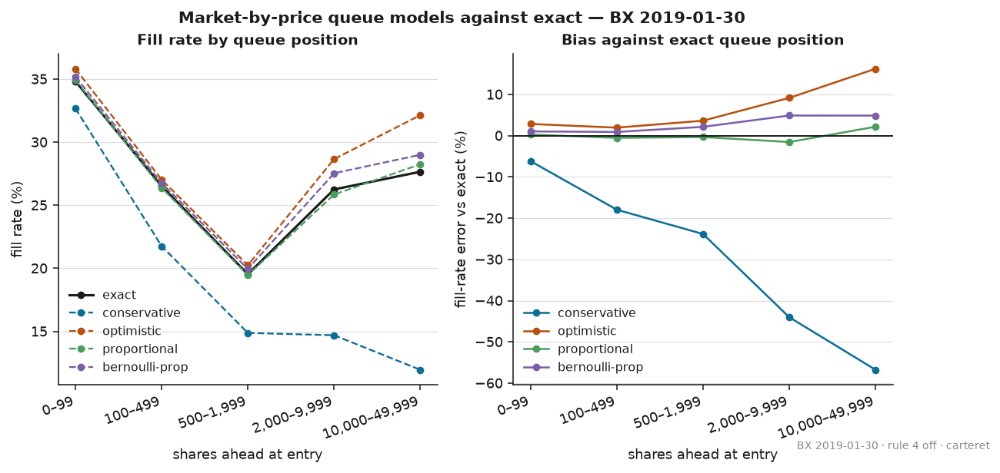
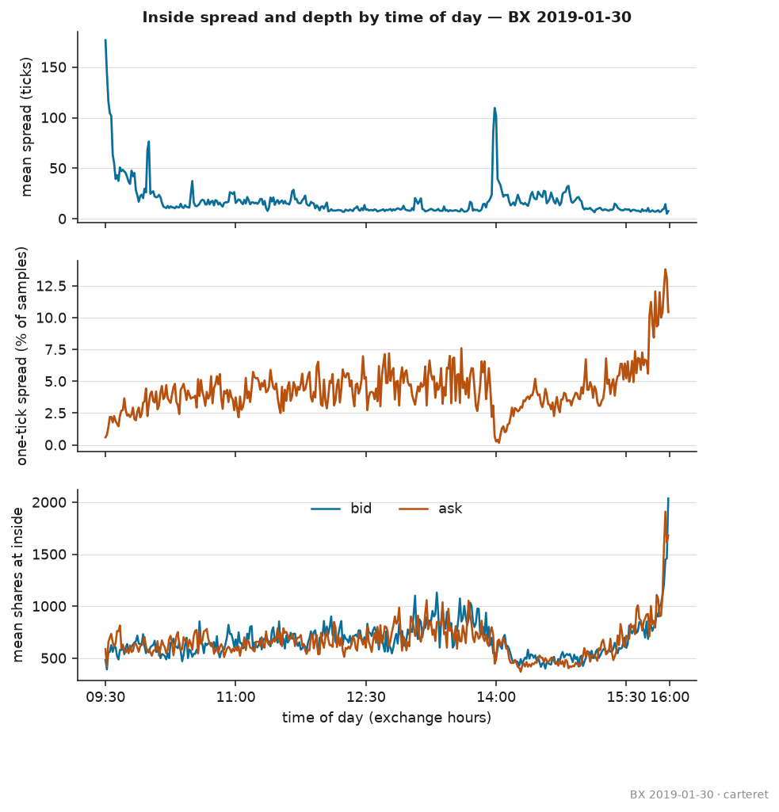
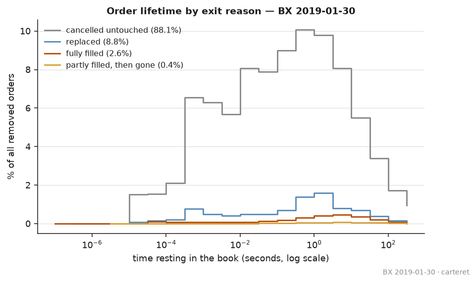
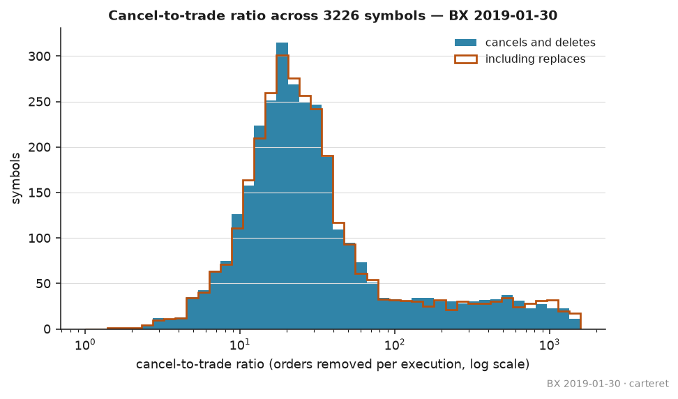
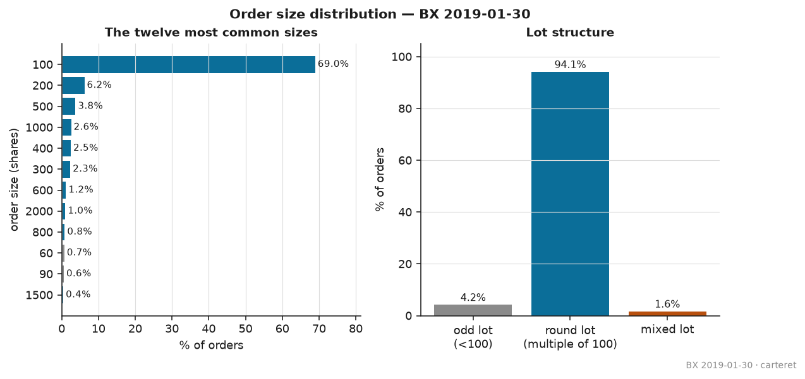

# Carteret

[](https://github.com/EkanshSingh401/carteret/actions/workflows/ci.yml)

A NASDAQ TotalView-ITCH 5.0 feed handler and market-by-order limit order book
in C++20. It is checked message by message against an independent reference
book over ten full trading sessions, timed on an isolated core with
per-message hardware-counter attribution, and used for two studies: how far
market-by-price queue models depart from exact queue position, and a
pre-registered predictive study run once on held-out sessions.

Named for the New Jersey data centre the ITCH 5.0 specification names as the
origin of the TotalView feed.

## Results

The figures in this section and the next carry a tag naming the committed
file they come from, and CI fails if that file does not contain them
([below](#numbers-are-checked-not-typed)).

### Correctness

| | |
|---|---|
| Sessions replayed against the reference book | **10** (eight NASDAQ, one BX, two held-out NASDAQ) |
| Messages compared | **3,037,078,470** <!--src:docs/data.md--> |
| Result | `RESULT: identical` on every session, no divergence |
| Parser census | 82,841,542 <!--src:docs/correctness.md--> messages of `20190130.BX_ITCH_50`, exact against `RITCH::count_messages()` on all 22 types it reports |
| Fuzzing | 407,989,301 <!--src:docs/correctness.md--> executions under ASan and UBSan, no findings |

"Identical" is checked after **every** message: the touched level's share
count, order count and full FIFO sequence of order references, and the best
bid and offer on both sides. The complete book state is hashed and compared at
fixed intervals and at end of session. The reference book is a
deliberately plain `std::map` / `std::unordered_map` / `std::list`
implementation; what agreement does and does not prove is in
[Correctness](#correctness-1). Per-session counts: `docs/correctness.md`.

### Performance — the shipped default

| | |
|---|---|
| Batch-timed, mean per book message | **167.78 ns** <!--src:docs/benchmarks.md--> — median of 5 runs, range 165.46 <!--src:docs/benchmarks.md--> to 168.92 <!--src:docs/benchmarks.md--> ns |
| Per-message p50, median of 5 runs | 120 ns <!--src:docs/benchmarks.md--> |
| Per-message p99 | 660 ns <!--src:docs/benchmarks.md--> |
| Per-message p99.9 | 1,140 ns <!--src:docs/benchmarks.md--> |
| DRAM fills per book message | 0.983 <!--src:docs/benchmarks.md-->, counted exactly with `rdpmc` |
| Session | `12302019.NASDAQ_ITCH50`, 264,478,375 <!--src:docs/benchmarks.md--> book messages per run, replayed from a memory-mapped file |
| Machine | AMD Ryzen 9 5950X, one core (cpu8) on an isolated CCD, boost, PBO and SMT off, 3.4 GHz fixed; GCC 13.4.0, Release |

The shipped default is multiply-shift hashing, 24-byte order records and a
256-tick sliding price window. Batch timing reads the clock around the whole
replay; per-message timing fences each call with `lfence; rdtsc` /
`rdtscp; lfence` and has the measured 20 ns <!--src:docs/benchmarks.md--> instrument cost
subtracted. The
two answer different questions and are reported separately: the mean carries
the tail, the median does not. Every run first replayed the session against
the reference book and reported identical, and `tools/machine_check.sh` was
clean before each of the 24 <!--src:docs/benchmarks.md--> experiments. Method, the full configuration
matrix and the raw machine report: [`docs/benchmarks.md`](docs/benchmarks.md).

Ten outcomes were predicted in writing before the first run on market data.
**Five failed** (below, and scored in full in `docs/benchmarks.md`).

### Queue-position bias

On two sessions, 93,525 <!--src:docs/design.md--> synthetic one-lot orders
each, placed at the inside, every model seeing identical placements and
identical executed volume:

| | BX 2019-01-30 | NASDAQ 2019-12-30 |
|---|---:|---:|
| Exact (market-by-order) fill rate | 25.12% <!--src:docs/design.md--> | 57.21% <!--src:docs/design.md--> |
| Conservative model, bias vs exact | **−20.9%** <!--src:docs/design.md--> | **−21.2%** <!--src:docs/design.md--> |
| Conservative, front of queue to back | −6% to −57% <!--src:docs/design.md--> | −3% to −64% <!--src:docs/design.md--> |
| Proportional model, bias vs exact | −0.5% <!--src:docs/design.md--> | −0.7% <!--src:docs/design.md--> |

The conservative model — the cautious choice a backtest reaches for — is the
worst, and worsens monotonically with queue depth on both sessions.
Proportional's small net bias is **not accuracy**: it is two errors of
opposite sign and comparable size (a shape term and an attribution term,
separated by an instrument model whose prediction was committed before it was
built) that both roughly double between the sessions while the net stays
near zero. The sessions differ in venue, date and symbol basket at once, so
no difference between them is attributed to venue. Detail:
[Queue-position bias](#queue-position-bias-1).

### Pre-registered study

Registration committed, CI-green and hash-locked before the held-out sessions
were downloaded; run once, on 2026-09-25.

| | |
|---|---:|
| Primary: queue imbalance predicts the sign of the next mid move over 50 book updates | |
| Held-out directional accuracy | **0.59601** <!--src:docs/generated/heldout/study.txt--> |
| 95% interval, intraday stationary bootstrap | [0.59431 <!--src:docs/generated/heldout/study.txt-->, 0.59771 <!--src:docs/generated/heldout/study.txt-->] |
| Registered economic bar | 55.16% <!--gen:accuracy_bar--> |
| Verdict | **SIGNAL HOLDS**, on those two sessions |
| Maker strategy built on it (exploratory) | **loses money in every arm at the base cost tier** |

Passive fills are adversely selected by −0.34 to −0.57 half-spreads per
fill (`docs/generated/heldout/study.txt`), which no add rebate closes. A signal that predicts direction and a
strategy that pays for it are different claims, and they came out
differently. The effect itself is documented prior art (Gould and Bonart,
2016); what is added is the cost-inclusive held-out test with exact queue
position. Detail, secondaries, and three harness amendments recorded rather
than smoothed over: [Pre-registered study](#pre-registered-study-in-detail).

## What Stage 4 found and did not apply

Measured on the same host and session as the default above. Each is a
recorded finding (`docs/design.md` record 044), **not a change to the shipped
book**: Stage 4's scope excluded `include/`, and each needs re-measuring on a
second session before it could justify a new default.

| Change | Batch ns/msg | Against the default | Why |
|---|---:|---:|---|
| Identity hash instead of multiply-shift | 142.36 <!--src:docs/benchmarks.md--> | 15.2% <!--src:docs/benchmarks.md--> faster | roughly increasing references land in neighbouring slots; 37% <!--src:docs/benchmarks.md--> fewer DRAM fills |
| 2,048-tick window instead of 256 | 155.89 <!--src:docs/benchmarks.md--> | 7.1% <!--src:docs/benchmarks.md--> faster | overflow 4.90% <!--src:docs/benchmarks.md--> → 1.03% <!--src:docs/benchmarks.md-->; the `std::map` overflow walk cost more than 833 MB <!--src:docs/benchmarks.md--> of level arrays |
| SPSC ring, parse on a second core | 219.93 <!--src:docs/benchmarks.md--> | **31% <!--src:docs/benchmarks.md--> slower** | the handoff costs more than the parse it moves |
| Chained index instead of open addressing | 179.84 <!--src:docs/benchmarks.md--> | 7.2% <!--src:docs/benchmarks.md--> slower | more instructions (IPC 1.13 <!--src:docs/benchmarks.md--> vs 1.20 <!--src:docs/benchmarks.md-->), not more misses |
| 32-byte order records instead of 24 | 171.16 <!--src:docs/benchmarks.md--> | 2.0% <!--src:docs/benchmarks.md--> slower | the predicted saving on line-straddling records did not appear |

Identity's advantage rests on how this venue assigns order references; a venue
that scattered them would reverse it. That is why it is recorded and not
applied.

**Where the misses are.** `perf mem` (IBS) attributes
48.3% <!--src:docs/benchmarks.md--> of DRAM-served loads to the overflow map, which
holds 4.9% <!--src:docs/benchmarks.md--> of orders; the order index takes
26.8% <!--src:docs/benchmarks.md--> and the pool 15.6% <!--src:docs/benchmarks.md-->. The
prediction that the index would dominate failed. The sample is small —
418 <!--src:docs/benchmarks.md--> DRAM-served loads, about ±5 points.

**The five failed predictions.** (2) Per-message p50 would sit above the batch
mean: it sits below (120 against 167.78 ns), and the comparison was badly
posed — a median against a mean that carries the tail. (4) The index would own
at least 40% of DRAM-served loads: the overflow map owns 48%. (6) Chaining
would lose on misses: it loses 7.2% on instructions and takes slightly fewer
misses. (8) SPSC would be within 5% of direct: it is 31% slower. (10)
Recenters would be rare, cheap to ignore, and set the maximum: they are
0.25% <!--src:docs/benchmarks.md--> of NASDAQ and 4.29% <!--src:docs/benchmarks.md--> of BX
messages, move p99.9 by 8.8% <!--src:docs/benchmarks.md--> and 36% <!--src:docs/benchmarks.md-->,
and do not set the maximum. The other five held in whole or in part; each part is scored in
`docs/benchmarks.md`.

**A first run that measured nothing, kept.** The first NASDAQ layout run
passed its order-size and window-width switches to CMake as cache variables
that never reached the compiler, so four "configurations" were four more
baseline runs. It was caught because every one reported the baseline's
703,924 <!--src:docs/benchmarks.md--> recenters. The build was fixed and the
four rerun; the invalid numbers are kept in the log as a measure of
run-to-run spread (2.5% <!--src:docs/benchmarks.md--> across separate processes).

## Limitations

**Performance**

- **Replay, not a wire path.** Messages are replayed from memory: no NIC, no
  kernel network stack, no MoldUDP64 receive, no kernel bypass. The figures
  are book-update cost, not wire-to-book latency.
- **Throughput, not responsiveness.** Replay has no arrival process and no
  queueing, so the numbers say nothing about behaviour under a real message
  rate.
- **One machine, one session for the full matrix.** Every configuration was
  timed on `12302019.NASDAQ_ITCH50` on the 5950X; BX 2019-01-30 has a baseline
  only. The book is about 20× the L3 it runs against, so a machine with a
  different memory system would give different numbers.
- **The ~1.1 ms maximum on `F` messages is unexplained.** In every baseline
  run the all-types maximum is about 1.1 ms, on an `F` (Add with MPID) message
  that triggers no recenter, with no page fault in the timed region. It recurs
  at the same size across runs, so it is a property of some message and not
  noise, and it is **not attributed**. The maximum is reported, not explained.
- **Raw benchmark output is not committed.** The runner wrote it to
  `results/` on the host, which is gitignored. The performance figures above
  trace to the transcription in `docs/benchmarks.md`, made at the time with
  the machine report embedded, and not to a raw file.
- **Per-message timing perturbs what it measures.** The fence costs about
  20 ns against a median of 120, and is subtracted; batch timing is the
  unperturbed figure.
- **Untested claims.** That the sliding window is not a throughput regression
  needs a fixed-window build, which was not run. The prefetch sweep did not run
  because its pre-set rule was not met.
- **Single-threaded.** Sharding by stock locate is the obvious parallelisation
  and is out of scope; the one two-core design measured (SPSC) was slower.

**Correctness**

- **No independent reconstruction.** LOBSTER's samples need proof of purchase
  and its sample date is not in the NASDAQ archive, so layer 3 is missing. A
  misunderstanding of the feed shared by both books would pass every remaining
  layer.
- **Raw differential output is committed for the two held-out sessions only.**
  The other eight counts were transcribed into `docs/data.md` from the runs.
- **The price axis is in cents**, correct for the 2019-2020 sessions used here
  and not for post-amendment tick sizes (`docs/design.md` record 005).

**Studies**

- **Two sessions each.** Two queue-bias sessions confounded in venue, date and
  basket; two held-out sessions for the pre-registered study, whose verdicts
  apply to those sessions only.
- **Hidden liquidity is invisible.** `P` reports non-displayed executions after
  the fact; those orders never enter the book.
- **Zero market impact** is assumed for every synthetic order: defensible for
  one round lot, not shown.
- **The study's symbol universe uses whole-day information** and could not have
  been chosen live.
- **One registered secondary was never implemented** (queue-position-conditioned
  OFI), and the strategy component is exploratory because two of its registered
  constants were never filled in.
- **Microstructure figures are one BX session**, BX's own book, not the NBBO.

**Out of scope:** matching engine, order entry and risk, GLIMPSE snapshot
recovery, web interface, containerisation.

## Numbers are checked, not typed

`tools/check_numbers.py` runs in CI and fails on any mismatch:

- every figure in `docs/preregistration.md`, and those in this README tagged
  `gen:`, must equal the value `research/gated.py` wrote to
  `docs/generated/gated_values.tsv`;
- every figure in this README tagged `src:<path>` must appear in that committed
  file.

`tests/numbers_negative.sh`, also in CI, breaks one figure, key and source at
a time and requires each to fail. The tags are HTML comments and do not
render. The sections below repeat the
tagged figures in context; their remaining numbers are quoted from the design
record or document each section cites.

## Pre-registered study, in detail

Registered before the held-out sessions were downloaded, run once on
2026-09-25. The registration is `docs/preregistration.md`, commit `29228cc`,
SHA-256 `28f10db45fff7316df6acca3c2871a9805511c893e1f8d36c4ac28e7f265708a`,
unchanged through three harness amendments. `research/heldout.lock` pins it.

**Primary hypothesis (candidate C).** Queue imbalance at the inside predicts
the sign of the mid-price change over the following 50 book updates.

| | |
|---|---:|
| Held-out directional accuracy | **0.59601** |
| 95% interval, intraday stationary bootstrap at *L* = 177.58 | **[0.59431, 0.59771]** |
| Registered economic bar | 0.5516 |
| Null | 0.5 |
| Windows with a nonzero move | 718,890 |

**SIGNAL HOLDS.** The interval lies entirely above both the null and the bar.
The symbol-clustered sensitivity — anti-conservative, and it decides nothing —
is [0.56603, 0.62599] over 67 symbols and agrees.

**The registered metric is conservative for C.** It scores a feature of
exactly zero as a *miss*, and queue imbalance is exactly zero in 6.8% of
moved windows. Accuracy is 0.596 as registered against **0.640 where the
feature is nonzero** (post-hoc, [0.63818, 0.64135]). The verdict held under a
metric that counted non-predictions as wrong answers.

**Secondaries**, Holm–Bonferroni over a registered family of five.

| Member | Estimate | 95% interval | Holm-adjusted *p* | |
|---|---:|---|---:|---|
| Order flow imbalance | 0.55436 | [0.55230, 0.55641] | < 1e-12 | significant |
| Trade-sign imbalance | 0.27460 | [0.26948, 0.27971] | 1 | not significant |
| Direct value | 0.29054 | [0.28776, 0.29332] | < 1e-12 | significant |
| Micro-price deviation | — | dropped: sign-identical to queue imbalance | — | — |
| Queue-position-conditioned OFI | — | **registered, not implemented, not run** | — | — |

Three of five members were tested. Micro-price deviation is legitimately
dropped. **Queue-position-conditioned OFI was never implemented**; it is named
in the registered family and no code produces it. The correction was applied
over five regardless, so the members that were tested carry a more
conservative threshold than four would have given, and no reported
significance is overstated. It is still a registered secondary that was not
run.

**Order flow imbalance appears twice, under two different tests.** As a Holm
secondary it is tested against the null of 0.5 — confirmatory, adjusted,
significant. As candidate A it is tested against its economic bar of 0.5516 —
exploratory, unadjusted, outside the family. Same feature and same estimate;
"better than chance" and "better than the cost floor" are different claims.

**Trade-sign imbalance: the registered test could not have succeeded.** The
metric scores a zero feature as a miss, and trade sign is zero in **53.8%** of
moved windows, because a window with no execution has no trade sign. Its
permutation null — *P(f>0)P(l>0) + P(f<0)P(l<0)* — is **0.231**, not 0.5, and
the achievable accuracy is capped near 0.46, below the null it was tested
against. "Not significant" was guaranteed before any data existed. The
registered verdict stands as reported; it is not evidence about the feature.
Post-hoc, trade sign is +0.0437 above its own null ([0.04250, 0.04484]) and
reaches 0.5946 where it is nonzero ([0.59209, 0.59703]). `docs/design.md`
record 039 registers the rule this should have followed.

**Direct-value secondary.** Mean signed mid move in the predicted direction,
over every window, with a zero feature contributing zero:
**0.29054 half-spreads per window**, [0.28776, 0.29332], against the
registered requirement of 0.10. Clears.

**Exploratory — candidates A and B**, considered and not selected by the
registered rule. A: 0.55436, [0.55230, 0.55641], bar 0.5516. B: 0.00348,
[0.00300, 0.00396], bar 0.0261. Outside every confirmatory claim and outside
the Holm family. A clears its bar and that remains exploratory.

### Exploratory — the maker strategy

**Exploratory, not confirmatory.** Section 8 of the registration left the
signal threshold and the minimum-fills rule unfilled, so this component was
never fully registered. It runs with declared parameters — signal threshold
zero, which is the primary's own sign rule and the only value requiring no
choice, and no minimum-fills rule — recorded in
`docs/heldout-harness-amendment.md` before any held-out feature was computed.

| Session | Rule 4 | Quotes | Fills | Fill rate | Gross/fill | Net, base | Net, top |
|---|---|---:|---:|---:|---:|---:|---:|
| 2019-10-30 | off | 377,165 | 30,373 | 8.05% | −0.384 hs | −$0.00207 | −$0.00052 |
| 2019-10-30 | on | 377,165 | 32,718 | 8.67% | −0.340 hs | −$0.00151 | +$0.00004 |
| 2020-01-30 | off | 688,247 | 46,545 | 6.76% | −0.571 hs | −$0.00412 | −$0.00257 |
| 2020-01-30 | on | 688,247 | 50,470 | 7.33% | −0.506 hs | −$0.00308 | −$0.00153 |

**The strategy loses money in every arm at the base tier.** The one positive
figure, +$0.00004/share, is a single session under the rule-4-on sensitivity
at the top tier — the most flattering combination available — and it rounds
to break-even. Both ingredients are ones the registration warns can only
flatter: rule 4 adds fills it cannot verify, and the top tier assumes more
than 1.5% of consolidated added volume.

**Why a signal that predicts direction still loses money.** Passive fills are
**adversely selected**. A resting quote fills when the market comes to it,
which is disproportionately when the price is about to move through it, so the
fills are a biased sample of the windows the signal was right about. Measured
here: gross **−0.34 to −0.57 half-spreads per fill** before any rebate. The
add rebate of $0.0015 to $0.00305 per share does not close a gap that size.

Crossing the spread instead does not help, and the arithmetic says so before
any test: taking costs about **2 half-spreads** — one to cross, one paid as
the take fee on a one-cent spread — against a signal worth **0.29
half-spreads** of directional value per window. *That is arithmetic on the
measured value, not a tested claim; no taker variant was run.*

**Tape correction, post-hoc.** The run applied the Tape C add rebate of
$0.0015 uniformly. The tape is derivable from the Stock Directory Market
Category (Q/G/S → C, N → A, A/P/Z/V → B), and Tapes A and B pay $0.0020.
Recomputing the rebate from the recorded fills — **the fills are unchanged
and reproduce exactly** — gives a weighted rate of $0.00171 to $0.00175 and
moves net P&L by about $0.00025 per share. Every arm remains negative at the
base tier.

### Scope

**With two held-out sessions, these confirmatory verdicts apply to those
sessions and are not generalised beyond them.** A block bootstrap within two
days estimates the uncertainty of a quantity measured on those two days.

### Limitations of the study

- **Two held-out sessions.** The scope sentence above is the whole of it.
- **The symbol universe uses whole-day information.** The 50 symbols per
  session are the 50 with the most book messages *in that session*, ranked
  over the complete day. A live strategy could not have chosen them. It is
  applied identically to development and held-out data, so it does not
  advantage the held-out result — but the universe is not implementable in
  real time.
- **Queue-position-conditioned OFI was registered and not run.**
- **The simulator assumes no market impact**, which is defensible for one
  round lot and not for more, and models **displayed liquidity only** — it
  sees no hidden or midpoint-pegged interest, and rule 4 exists precisely
  because a non-displayed print cannot be attributed.
- **The exit is a modelled liquidation at the mid**, which overstates
  realisable P&L by the exit's own half spread. A round-trip maker strategy
  would have to earn the spread twice.
- **The tape recalculation is post-hoc**, not what the run executed.
- **The strategy component is exploratory**, because two of its registered
  constants were never filled in.

### Amendment history

The registration was never edited. Three amendments to the *harness* are
recorded in [`docs/heldout-harness-amendment.md`](docs/heldout-harness-amendment.md):

1. The held-out path did not implement the registered rules — wrong
   estimator, wrong unit of analysis, and no verdict at all.
2. The strategy demoted to exploratory, with declared parameters, and a CI
   gate on unfilled placeholders in the registration.
3. The runner was still wired to the script the first amendment replaced.
   Two prior amendments and two locks described a wiring that did not exist.

Earlier amendments to the registration itself, all made before the held-out
data was reachable, are in [`docs/preregistration.md`](docs/preregistration.md):
the block-length rule, candidate B's summand, the *m* population, and the
held-out window projection.

### Prior art

Queue imbalance predicting the direction of the next mid-price move is a
documented effect: **Gould and Bonart, "Queue Imbalance as a One-Tick-Ahead
Price Predictor in a Limit Order Book", *Market Microstructure and Liquidity*
2(1), 2016**. Finding it again is not a novel result. What this study adds is
the cost-inclusive held-out test with exact market-by-order queue position,
and the finding that the signal holds while the strategy built on it does not
pay.

## Prior art

Reconstructing exact FIFO queue position from market-by-order data is **not
novel**. HftBacktest ships an `L3FIFOQueueModel`, and its Level-3 tutorial
builds L2 data from L3 to compare the two backtests on crypto futures. This
project implements a known model.

The contribution claimed here is narrower: **the quantified fill-rate and
time-to-fill bias of each market-by-price approximation against exact queue
position, on US-equity ITCH sessions, with the fill rules stated explicitly**,
broken out by queue depth at entry and by symbol. See `docs/design.md` records
020 and 021.

The pre-registered study is **predictive** (interval *t* predicts interval
*t+1*). Cont, Kukanov and Stoikov (2014) report a **contemporaneous** R² of
approximately 65% over 10-second windows. The two are not comparable and are
never presented as though they were; see `docs/design.md` record 023.

## Correctness

Five layers, each proving something different and each naming what it does not
prove. `docs/correctness.md` carries the detail and the per-session results.

| Layer | Proves | Does not prove |
|---|---|---|
| 1. Byte fixtures, tiling audit, fuzz | Field offsets and framing | Anything about the book |
| 2. Census against an independent counter | The framing loop walks the file correctly | Field decode |
| 3. LOBSTER row-by-row replay | **Not available.** LOBSTER's samples are gated behind proof of purchase, and its sample date has no counterpart in the NASDAQ archive | — |
| 4. Differential replay against the reference book | The fast book matches the obvious one | That the obvious one is right |
| 5. Continuous invariants and determinism hashes | Internal consistency; that a rerun is the same run | Agreement with the venue |

The reference book — `std::map`, `std::unordered_map`, `std::list` — is
permanent, not a stepping stone. It is both the differential oracle and the
speedup baseline.

**Layer 3 is unavailable, and that leaves a real gap.** Nothing now constrains
the book's semantics against an independently built reconstruction. A shared
misunderstanding of the feed — if `U` did not in fact lose queue priority at
an unchanged price, say — would pass every remaining layer. `docs/correctness.md`
records what was checked and what would close it.

### Wire format

NASDAQ BinaryFILE precedes each message with a 2-byte big-endian length.
`FrameReader` treats the prefix as authoritative
for advancing and additionally checks it against the specification length for
known types in one table lookup. A frame whose length disagrees, or whose type
is unknown, is skipped by its prefix length and counted, never parsed, so that
one malformed frame cannot desynchronise the rest of the session
(`docs/design.md` record 001).

One file in circulation breaks that assumption: `ex20101224.TEST_ITCH_50`,
bundled with the RITCH R package, carries the prefix field for all 12,012 of
its messages and leaves every one zero. Since a zero prefix otherwise closes a
file, the two cannot be read under one rule; the form is identified before the
walk and reported by the census (`docs/design.md` record 025).

**How a session ends, and how to know it is complete.** The ITCH 5.0
specification guarantees that System Event `'C'`, End of Messages, is the last
message of the day. It says nothing about a zero-length prefix — that is a
third-party description of the file packaging, and NASDAQ's own sessions do
not write one. So a truncated download is a *well-formed prefix of a valid
file*: every message parses, the framing consumes every byte, and nothing
about the bytes says it is incomplete.

The only thing that distinguishes it is the missing `'C'`. `census` therefore
checks the final message and **exits nonzero if it is not End of Messages**,
alongside the gzip and length checks in `tools/fetch_data.sh`. The round-trip
test generates a session with no final System Event and requires the census to
reject it, so the check cannot quietly stop working
(`docs/design.md` record 032).

Multi-byte fields are decoded with `memcpy` plus `__builtin_bswap`, never a
pointer cast: the 64-bit order reference at offset 11 is unaligned, and the
cast is both an unaligned load and a strict-aliasing violation. Timestamp and
tracking number come from a single 8-byte load at offset 3. Generated assembly
and the command that produced it are in `docs/design.md` record 002.

### Specification behaviour that reconstructions get wrong

All of the following are documented inline in `spec.hpp` at the relevant field.

1. `E`, `C` and `X` carry **cumulative deductions**, not absolute sizes. An
   order reaching zero displayed shares is removed even without a `D`.
2. `U` carries **no side, stock or attribution**; all three are retained from
   the original Add. It mints a new reference and loses queue priority
   unconditionally, including when the price is unchanged.
3. `E` has **no price field**; the resting order's price applies. `C` carries
   its own price and a Printable flag.
4. `P` has **no book effect**. Its order reference has been zero since December
   2010 and its side field hardcoded `'B'` since 14 July 2014, so trade sign
   cannot be read from it.
5. `B` and `Q` have no book effect either, and **`B` and `D` can arrive after
   the end-of-system-hours event**.
6. Order references are **day-unique but not sequential** — the guarantee that
   they increase was removed in February 2009 — so a flat array indexed by
   reference is unsafe.
7. Stock Locate codes are **session-scoped**. Cross-session tooling keys on the
   symbol.
8. `V` (MWCB Decline Level) uses **Price(8)**, not Price(4).
9. `K` (IPO Quoting Period Update) carries `ReleaseTime` in **seconds** since
   midnight, not nanoseconds, and its Stock Locate is documented as always 0.
10. `Q` (Cross Trade) may legitimately report **zero shares**.

## Queue-position bias

**Scope: two sessions, one per venue — NASDAQ BX 2019-01-30 and NASDAQ
2019-12-30 — 50 symbols each, one order size. Every number in this section
carries that scope.**

**Venue and date are confounded and cannot be separated.** There is one
session per venue and they are eleven months apart, so any difference between
the two columns below is a difference between *BX on 2019-01-30* and *NASDAQ
on 2019-12-30* together. It is **not** attributable to venue: December 2019
differs from January 2019 in volatility, in tick-size regime participation, in
the symbols that were active, and in whatever else moved over eleven months.
Separating the two would need several sessions per venue on overlapping dates,
which this project does not have. Nothing below should be read as "BX behaves
like X and NASDAQ like Y".

The claimed contribution. Exact FIFO queue position from market-by-order data
is **not novel** — HftBacktest ships an `L3FIFOQueueModel` and this implements
the same idea. What is measured here is how far each **market-by-price
approximation** departs from exact position, with the fill rules fixed in
advance (`docs/design.md` record 020) and cited by number from the
pre-registration.

93,525 synthetic orders per session, one round lot each, placed at the inside
at random times, cancelled after 60 seconds if unfilled. All five models see
the identical placements and the identical executed volume; they differ
**only** in how a cancel at the price is attributed, which is what isolates
the bias.

**Symbol selection, applied identically to both sessions:** the 50 symbols
with the most book messages in that session, chosen from that session's own
activity. The rule is the same; **the resulting symbol sets are not**. They
share 21 of 50 names — AMD, BABA, FB, INTC, MU, QQQ, SPY and other large
ETFs and liquid single names — and differ on the remaining 29. So the two
columns describe different baskets as well as different venues and different
dates, which is a third reason not to read the difference as a venue effect.



Two independent uncertainty estimates accompany every figure below, because
they answer different questions. The **symbol cluster bootstrap** (10,000
replications, resampling the 50 symbols with replacement) asks how much the
result depends on which symbols were sampled. The **seed range** across ten
independent placement sequences asks how much it depends on which orders were
placed. Both are reported for the *bias*, which is paired — every model sees
the same placements — so placement noise largely cancels and a bias must not
be compared against the seed range of the fill-rate *level*.

| Model | Fill rate | Bias vs exact | 95% CI (symbol bootstrap) | Seed range | Median time to fill |
|---|---:|---:|---|---:|---:|
| **Exact (market-by-order)** | **25.12%** | — | — | — | 18.1 s |
| Conservative | 19.87% | **−20.9%** | [−24.4, −17.7] | 1.01 pp | 21.2 s |
| Optimistic | 25.84% | +2.9% | [+1.9, +4.0] | 0.44 pp | 17.2 s |
| Proportional | 24.99% | −0.5% | [−0.79, −0.27] | 0.36 pp | 18.2 s |
| Bernoulli-proportional | 25.48% | +1.4% | [+0.80, +2.16] | 0.40 pp | 17.7 s |

Every interval excludes zero, and every bias has the same sign in all ten
placement sequences on both sessions. But the magnitudes differ by two
orders: conservative's bias is twenty times its own seed range on BX and
forty-seven times on NASDAQ, while proportional's is barely larger than its
own on either. **Conservative's bias is a finding; proportional's is a real
but negligible effect**, and it would be wrong to present the two as
comparable results.

**On pooling.** No pooled figure is quoted above. If one were, its weight
would be placements, which is exactly 50/50 here because the placement
schedule is identical across sessions by construction — so a pooled fill rate
would be the unweighted mean of 25.12% and 57.21%, a number describing
neither session. Pooling is doubly inappropriate for anything cost-inclusive:
**BX is taker-maker and NASDAQ is maker-taker**, so a rebate-bearing figure
pooled across them is not a quantity at all. No cost-inclusive result in this
repository pools the two venues.

The fifth model is an instrument rather than a candidate. It takes the
proportional model's assumed ahead-share as a coin instead of an average and
removes the cancelled order all-or-nothing, so it has proportional's mean and
exact's shape; it exists to separate the two, and what it shows about
proportional is below.

### The bias is small in aggregate and severe where it matters

Pooled, proportional's bias is small on both sessions and even optimistic is
only 3% high on BX. **A small pooled bias is not accuracy** -- it is two
errors of opposite sign cancelling, and the decomposition below shows both
roughly double between the two sessions while the net barely moves.
That aggregate hides the result:

**BX 2019-01-30**

| Shares ahead at entry | n placed | Exact | Conservative | Optimistic | Proportional | Bernoulli |
|---|---:|---:|---:|---:|---:|---:|
| 0–99 | 1,114 | 34.8% | −6.2% | +2.8% | +0.3% | +1.0% |
| 100–499 | 65,462 | 26.5% | −17.9% | +1.9% | −0.5% | +0.9% |
| 500–1,999 | 19,877 | 19.5% | −23.8% | +3.6% | −0.4% | +2.1% |
| 2,000–9,999 | 6,403 | 26.3% | −44.0% | +9.2% | −1.5% | +4.9% |
| 10,000–49,999 | **669** | 27.7% | **−56.7%** | +16.2% | +2.2% | +4.9% |

**NASDAQ 2019-12-30.** Deeper queues and far more of them: the 10,000+ bucket
holds 7,207 placements against BX's 669, and a 50,000+ bucket exists at all.

| Shares ahead at entry | n placed | Exact | Conservative | Optimistic | Proportional | Bernoulli |
|---|---:|---:|---:|---:|---:|---:|
| 0–99 | 7,415 | 58.9% | −3.3% | +1.6% | −0.3% | +0.3% |
| 100–499 | 29,413 | 62.6% | −10.0% | +3.4% | −0.8% | +2.1% |
| 500–1,999 | 30,144 | 58.7% | −24.3% | +6.2% | −1.0% | +3.4% |
| 2,000–9,999 | 17,051 | 55.2% | −35.0% | +9.9% | −0.4% | +3.7% |
| 10,000–49,999 | 7,207 | 46.0% | **−47.0%** | +14.6% | −0.6% | +4.0% |
| 50,000+ | 2,295 | 13.4% | **−63.8%** | +34.5% | +5.5% | +11.1% |

**This is where the NASDAQ session earns its place.** The BX result's weakest
number was the +2.2% in its 669-placement bucket, which a dozen orders could
have moved across zero. NASDAQ resolves the same region with 7,207 placements
and puts proportional at **−0.6%** there, not +2.2% — so the apparent sign
flip at depth on BX does not reproduce. What does reproduce is conservative
worsening monotonically with depth, on both sessions, reaching −56.7% and
−63.8% at the back of the queue.

The conservative model — the cautious choice, the one a backtest reaches for
to avoid overstating fills — is the worst, and it gets worse the deeper the
queue, reaching a **57% understatement** at the back. Deep in the queue almost
every fill arrives through cancellation of the orders in front, and
conservative assumes by construction that cancellation never happens ahead.

**BX's deepest bucket holds only 669 placements**, against 65,462 in its modal
one. Its percentages move by 0.15 points per order, so the −56.7% is a solid
finding while the +2.2% beside it is not: a dozen orders either way would move
it across zero. The NASDAQ session, with 7,207 placements in the same bucket,
reports **−0.6%** — which is what a thinly-populated cell not reproducing
looks like, and why the BX figure was flagged rather than quoted.

### Why proportional's bias is small, and why that is not accuracy

Proportional assumes a cancel of *c* shares from a level of *d* with *a* ahead
removes *c·a/d* from in front. Whether that is right is not a matter of
opinion — the exact model knows, for every cancel, whether the cancelled order
was actually ahead. Recording both makes the error directly observable.

| Shares ahead at entry | Cancelled shares | Actually ahead | Proportional assumed | Error |
|---|---:|---:|---:|---:|
| 0–99 | 1,114,909 | 1.57% | 1.70% | +0.13 pp |
| 100–499 | 213,248,543 | 4.37% | 4.55% | +0.18 pp |
| 500–1,999 | 138,361,218 | 11.52% | 12.16% | +0.63 pp |
| 2,000–9,999 | 152,819,508 | 12.09% | 13.66% | +1.57 pp |
| 10,000–49,999 | 32,577,446 | 21.26% | 25.26% | **+4.00 pp** |
| **All** | **538,121,624** | **9.42%** | **10.34%** | **+0.92 pp** |

The error is positive everywhere and grows with depth: proportional
consistently attributes **more** of each cancel to the queue ahead than
actually was there, so it advances the queue too fast.

**This confirms the prediction from the Stage 6 lifetime data.** Cancels
concentrate sharply among recently-added orders — 66.6% of cancelled-untouched
orders are cancelled within one second of being added, 45% within 100 ms — and
recently-added orders are, by construction, *behind* a synthetic order placed
earlier. A uniform assumption therefore over-attributes to the front.

**But the naive inference from that to the fill rate does not follow, and the
data shows where it fails.** A positive attribution error should mean
over-estimated fills, yet proportional's pooled fill-rate bias is
*negative* (−0.5%), turning positive (+2.2%) only in the deepest bucket where
the attribution error is largest.

### Separating the two errors, with the prediction recorded first

The explanation for that is a second error of the opposite sign: exact removes
a cancel from the queue ahead all-or-nothing, while proportional always
removes a fraction, so the two differ in the *variance* of the ahead-count as
well as its mean. That was an argument, not a measurement, so it was given a
test — and the test's prediction was written into `docs/design.md` record 035a
and committed before the instrument existed.

The instrument is the **Bernoulli-proportional** model: proportional's assumed
ahead-share taken as a coin, with the cancelled order removed in full on a hit
and not at all on a miss. Same mean as proportional, same all-or-nothing shape
as exact, so what is left when it is compared against exact is the attribution
error alone.

| Term | BX | NASDAQ | What it is |
|---|---:|---:|---|
| Shape | **−2.0%** | **−3.5%** | proportional minus Bernoulli: the cost of removing cancels as a fraction rather than in jumps |
| Attribution | **+1.4%** | **+2.8%** | Bernoulli minus exact: what remains once the shape matches |
| **Net** | **−0.5%** | **−0.7%** | proportional minus exact — the small figure reported above |

**The structure reproduces on both sessions and the magnitudes do not.** Both
terms are roughly twice as large on the NASDAQ session while the net barely
moves, which is the argument in one line: the small net is a cancellation
whose size is not stable, not an accuracy that is.

The residual is positive in every depth bucket and rises with depth — 1.0,
0.9, 2.1, 4.9, 4.9 — in the same order as the attribution error's 0.13, 0.18,
0.63, 1.57, 4.00 pp. Proportional's own bias does neither: it is non-monotone
and changes sign twice. Matching the shape is what makes the residual behave
like the error that is known to be there.

**The prediction was half wrong, and the correction matters.** Record 035a
predicted that matching the shape would *close most of the gap* to exact. It
did the opposite: the Bernoulli model's bias is nearly three times
proportional's, because the two terms are of comparable size rather than one
dominating. So **proportional's bias is not small because the model is nearly
right — it is small because two errors of comparable magnitude cancel**, and
nothing holds that balance in place. The shape term depends on how fill
probability curves with queue position; the attribution term depends on how
concentrated cancellation is among young orders. Those are different
properties of a market, and there is no reason for them to stay matched.

**The near-zero net is not evidence that the approximation transfers.** It
reproduced on a second session, and that is worth exactly as much as two
observations are worth: both component terms roughly *doubled* between them
while the net stayed put, which is what a cancellation looks like when it
happens to survive, not what a stable property looks like. And the two
sessions differ in venue, date and symbol basket simultaneously (record 037),
so even the reproduction cannot be attributed to any one of the three. A user
of the proportional model should expect its bias to be small on data
resembling these two sessions, and should not expect it to be reliably small
anywhere else.

A second check, on the curvature of fill probability against the ahead-count,
**did not settle its question** and is reported as inconclusive in record 035b
rather than counted as agreement. The pooled curve is confounded — depth at
entry is not assigned at random, and a symbol with a deep queue is one that
trades often — and the within-symbol curve can only be estimated over the
range where enough symbols contribute, which excludes exactly the deep region
where the effect would be largest.

### Where the fills come from explains the value

Value is reported in **half-spreads at entry**. An order resting at the inside
starts half a spread better than the mid, so 0 means the mid moved exactly far
enough to give that edge back, and −1 means it moved twice as far. All three
horizons are shown; **the one-second figure is the one quoted in the summary
above**, because it is the horizon at which adverse selection is largest and
therefore the least flattering.

**BX 2019-01-30**

| Model | 1 s | 10 s | 60 s | Fills valued | Trade-through share of fills |
|---|---:|---:|---:|---:|---:|
| Exact | **−0.77** | −0.61 | −0.56 | 23,493 | 49% |
| Conservative | **−1.28** | −1.04 | −1.06 | 18,581 | 79% |
| Optimistic | **−0.72** | −0.58 | −0.51 | 24,166 | 46% |
| Proportional | **−0.79** | −0.62 | −0.57 | 23,367 | 50% |
| Bernoulli-proportional | **−0.74** | −0.59 | −0.53 | 23,827 | — |

**NASDAQ 2019-12-30**

| Model | 1 s | 10 s | 60 s | Fills valued |
|---|---:|---:|---:|---:|
| Exact | **−1.06** | −1.15 | −1.21 | 53,508 |
| Conservative | **−1.85** | −2.00 | −2.06 | 42,169 |
| Optimistic | **−0.84** | −0.95 | −1.02 | 56,807 |
| Proportional | **−1.09** | −1.21 | −1.28 | 53,131 |
| Bernoulli-proportional | **−0.97** | −1.08 | −1.16 | 55,020 |

**The two sessions disagree about the shape of adverse selection over time,
and the disagreement is not small.** On BX it *decays*: −0.77 at one second
improving to −0.56 at a minute. On NASDAQ it *deepens*: −1.06 worsening to
−1.21. On BX the one-second figure is the least flattering and is therefore
the headline; on NASDAQ the least flattering is the sixty-second figure. This
is exactly the kind of difference the confound makes uninterpretable — venue,
date and basket all differ — and it is reported rather than reconciled.

What holds on both is the ordering. Conservative's filled orders are much the
worst on both sessions, because the fills it does admit are dominated by
trade-throughs: it refuses to advance the queue on cancellations, so the only
way its orders fill is for the market to run them over. That is a mechanical
consequence of the model and it appears on both sessions.

Every model is negative at every horizon: on this venue and session a passive
fill at the inside is adversely selected by more than the half-spread it
earns, before any fee. That is the expected direction and it is worth stating
plainly, because it is the number a maker strategy has to overcome.

The conservative model is 66% more pessimistic than exact at one second, and
the mechanism is visible in the fill reasons: **79% of its fills are
trade-throughs against 49% for exact**. Refusing to advance the queue on
cancels means it only ever fills when the market runs through the level — and
those are precisely the adversely selected fills. So the conservative model is
biased twice, in the same direction: it under-reports how often a passive
order fills, and over-reports how badly it does when it does.

### Rule 4 is a modelling choice, reported both ways

A non-displayed print at the order's price is not evidence the order filled:
`P` carries no usable side and midpoint-pegged prints trade between ticks. The
study runs twice from the same seeds.

| | Exact fill rate | Conservative bias | Proportional bias |
|---|---:|---:|---:|
| Rule 4 off | 25.12% | −20.9% | −0.5% |
| Rule 4 on | 25.82% | −18.6% | −0.5% |

Enabling it lifts every fill rate by roughly 0.7 percentage points and changes
no conclusion above.

### Limitations

- **Two sessions, one per venue, 50 symbols each, one order size.** Venue,
  date and basket are confounded (record 037), so nothing here is a venue
  effect. The mechanism behind conservative's bias — that its fills are
  trade-throughs by construction — does not depend on the venue; the
  particular numbers do.
- **Zero market impact.** The synthetic order never affects the flow it is
  measured against. Defensible for one round lot, assumed rather than shown.
- **Double counting**, stated in record 020 rule 5: when the synthetic order
  fills, the real order that triggered the fill still executes in the replay,
  so liquidity at the price is double counted by one round lot.
- Hidden liquidity is invisible, so fills against it are unmodelled.
- Value is measured against the mid on the **same venue**, not the NBBO.
- The symbol bootstrap resamples 50 symbols from one session, so its intervals
  describe uncertainty over symbols and **not** over days. A second session
  could sit outside every interval above.

## Microstructure findings

From `20190130.BX_ITCH_50`, one venue and one session. Every figure below is
in `docs/figures/` and is regenerated by `research/microstructure.py` from the
aggregates `export_micro` writes. **These describe BX's own displayed book,
not the consolidated NBBO** — a wide spread here means BX was wide, not that
the national market was.

### Spreads narrow through the day; depth builds into the close



Averaged over the 50 busiest symbols, sampled once a second of exchange time:

| | first 30 min | midday | last 30 min |
|---|---:|---:|---:|
| Mean spread (ticks) | 54.2 | 9.6 | 8.3 |
| Mean shares at the inside | 609 | — | 945 |

The narrowing from the open **agrees** with the standard account of intraday
liquidity. The absence of any widening into the close **disagrees** with the
U-shaped spread pattern usually reported for US equities: on this venue and
session the last half hour is the tightest of the day, and depth rises by half
again rather than thinning. One-tick spreads rise from under 1% of samples at
the open to about 13% in the final minutes.

### The 14:00 spike is the FOMC statement

Mean spread across the universe runs at 17.5 ticks at 13:55 and reaches 109.6
ticks at 13:59, recovering to 21.9 by 14:08. The January 2019 FOMC statement
was released at 14:00:00 ET on this date. Liquidity withdraws in the two
minutes before the release and returns within ten.

This is not a microstructure result so much as a check: an independently dated
event landing on the right minute is evidence that the 6-byte timestamps
decode correctly and that the book is being rebuilt in the right order.

### Almost nothing that rests gets filled



Of 38.3M orders removed from the book:

| Exit | Share |
|---|---:|
| Cancelled untouched | 88.1% |
| Replaced | 8.8% |
| Fully filled | 2.6% |
| Partly filled, then gone | 0.4% |

65.1% of removed orders lasted under one second. The median cancelled order
rested 178 ms; the median fully filled order rested 1.8 s. The high
cancellation rate **agrees** with the published picture of modern equity
markets. The gap between the two medians is the queue-position problem in one
line: orders that fill are the ones that survive long enough to reach the
front.

A replace is counted separately from a cancel throughout. It removes an order
without removing the interest behind it, and pooling the two would overstate
cancellation by nine points.

### Cancel-to-trade is about 24, with a long right tail



Across the 3,226 symbols with at least 1,000 orders and at least one
execution, the median symbol removes **24.3 orders per execution** (quartiles
14.9 and 48.4). Including replaces moves the median only to 24.6. This is in
the range usually reported for US equities, so it **agrees**, with the caveat
that the ratio is strongly venue-dependent and BX is a small venue.

**1,780 of 7,273 symbols — 24.5% — had no execution at all on BX that day**,
despite having a book. That is a fact about a low-share venue rather than
about the symbols.

### Order sizes are overwhelmingly round lots



69.0% of orders are for exactly 100 shares, 94.1% are round lots, and only
4.2% are odd lots. This **disagrees** with the widely cited growth of odd-lot
activity — but that statistic is normally about *executed trades* across all
venues, often dominated by high-priced names, whereas this counts *submitted
orders* on one venue. The two are not the same measurement, and the
disagreement is most likely a difference in what is being counted rather than
in what happened.

### What these do not establish

One venue, one session, and a 50-symbol universe for the spread and depth
panels. Nothing here is evidence about NASDAQ, about other dates, or about the
consolidated market. The ordering of magnitudes is likely to hold; the
particular numbers are not.

## Data

Free, large, and redistribution-restricted, so `data/` is gitignored and
sessions are fetched, never committed. Checksums are listed in the archive but
not served, so `fetch_data.sh` reports integrity as unverified rather than
skipping the check silently; see `docs/data.md`.

```sh
tools/fetch_data.sh                             # BX 2019-01-30, ~1.1 GB packed
./build/release/census data/20190130.BX_ITCH_50
tools/census_vs_ritch.sh data/20190130.BX_ITCH_50
```

`docs/data.md` lists every available session with its venue, date and size, and
records which the study treats as development and which as held out. It also
records that `20170130.BX_ITCH_50` is no longer served — sessions are withdrawn
from the archive over time, which is why every result names its session and
every fetch verifies a checksum.

BX carries roughly a fifth of a NASDAQ session's messages, which makes it the
right target for correctness iteration. BX is taker-maker and NASDAQ is
maker-taker, so the two are never pooled in a cost-inclusive result
(`docs/design.md` record 022).

## Build

```sh
cmake --preset release
cmake --build --preset release
ctest --preset release
```

Sanitizers, over a full session before any result is believed:

```sh
cmake --preset asan && cmake --build --preset asan && ctest --preset asan
```

Fuzzing, which needs a Clang that ships libFuzzer:

```sh
tools/fuzz.sh 600      # seconds; seeds the corpus on first run
```

Presets: `release`, `asan`, `fuzz`, `bench`. Everything builds warning-free
under GCC 13+ and Clang with libc++, at
`-Wall -Wextra -Wpedantic -Wshadow -Wconversion`. `-march=native` stays off for
anything published.

### macOS

Correctness work runs on macOS unchanged. Two differences:

- **libFuzzer** does not ship with Apple Clang. `brew install llvm`, then
  configure the `fuzz` preset with
  `-DCMAKE_CXX_COMPILER=$(brew --prefix llvm)/bin/clang++`.
- **Latency numbers** require x86_64 Linux with core isolation and `perf`.
  `tools/machine_check.sh` reports whether a host qualifies and refuses to
  pretend otherwise.

## Layout

```
include/carteret/
  spec.hpp            message types, lengths, field offsets, tiling audit
  wire.hpp            BinaryFILE framing, big-endian decode
  messages.hpp        zero-copy typed views, one per message type
  parser.hpp          handler-templated framing loop and dispatch
  book_types.hpp      the vocabulary both books share
  reference_book.hpp  the simple book: differential oracle and baseline
  fast_book.hpp       flat levels, bitmap BBO, pooled intrusive FIFO
  order_index.hpp     open-addressed index, hash as a template policy
  hash_policy.hpp     identity, multiply-shift, std::hash
  differential.hpp    message-by-message comparison of the two books
  determinism.hpp     event-stream and book-state hashes
  moldudp64.hpp       packet framing, gap detection, line arbitration
  queue_sim.hpp       synthetic orders and the five queue models
  sha256.hpp          in-tree, for the determinism hashes
  mapped_file.hpp     read-only mmap
src/
  census.cpp          per-type message census (correctness layer 2)
  replay.cpp          differential replay over a session (layer 4)
  determinism.cpp     event-stream and book-state hashes (layer 5)
  export_micro.cpp    microstructure aggregates
  export_features.cpp signal features and labels
  queue_study.cpp     the queue-position bias study
  strategy_pnl.cpp    the exploratory maker strategy
bench/                harness, fenced timer, rdpmc counters, attribution,
                      SPSC and chained-index variants, Linux runner
tools/                census comparison, data fetch, machine check, fuzzing,
                      numbers and placeholder gates
tests/                unit, fixture, differential, determinism and fuzz targets
research/             Python analysis; run_heldout.sh and its lock
docs/design.md        44 numbered design decision records
docs/benchmarks.md    structural measurements and the experiment log
docs/correctness.md   the five verification layers
docs/data.md          sessions, venues, provenance, study split
docs/preregistration.md                the registration, unchanged since 29228cc
docs/heldout-harness-amendment.md      three harness amendments
docs/generated/       committed output of the held-out run and gated values
docs/figures/         committed figures; never market data
```

## Milestones

Tags mark verified states, not intentions, and are monotonic in commit order.
A tag is applied only once the evidence for it exists in the repository.

| Tag | Stage | State |
|---|---|---|
| `v0.1.0` | 0–1 | framing, parser and census, per-type counts verified against an independent implementation |
| `v0.2.0` | 3 | differential book verified on two venues, 339M messages compared, `RESULT: identical` |
| `v0.3.0` | 5 | feed handling — MoldUDP64 framing, gap detection, line arbitration, determinism hashes — applied after CI went green on both compilers and both platforms |
| `v0.4.0` | 7 | queue-position bias on two sessions, reported per session |
| `v0.5.0` | 8 | the pre-registered study, held-out result reported under the registered decision rules |
| `v0.6.0` | 4 | latency and miss attribution on the Ryzen 9 5950X, scored against predictions recorded before the run |
| `v1.0.0` | — | results-first README, every headline figure gated against a committed file, limitations current |

Stages did not complete in numeric order. Stage 3's gate needed a 3.5 GB
NASDAQ session whose download failed three times, so Stage 5's code landed
first and Stage 3's verification came later; the tags follow the order in
which each stage's evidence arrived, not the order the stages are numbered.
`v0.3.0` was held back until CI had run, because what it marks is a claim
about two compilers and two platforms agreeing, and that claim cannot be made
from one machine. Stage 8's evidence arrived before Stage 4's benchmark host
was available, so the study is `v0.5.0` and the benchmarks `v0.6.0`.
